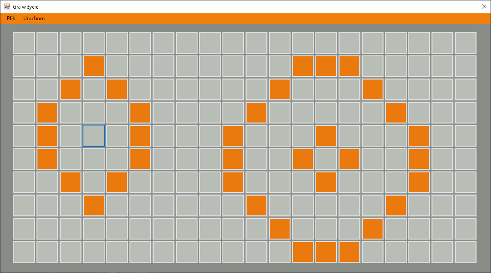
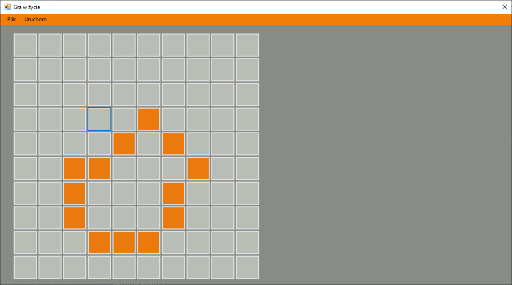
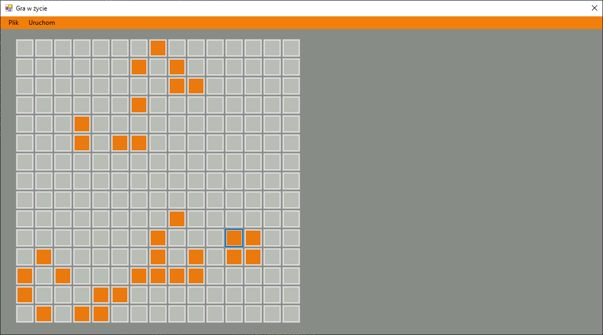

# TheGameOfLife

## Description of the application
The Game of Life application takes place on a board which is a two-dimensional rectangular grid of cells. There are four different board sizes to choose from in the app. Each cell can be alive or dead. The status of each cell changes each game turn depending on the status of that cell's eight neighbors. The application gives you the option of "clicking" the first generation, or loading it from a .txt file, and after starting the timer, the application generates subsequent generations at set intervals.

## Tools and technologies
* Visual Studio 2022
* .NET Framework 4.7.2

## Graphic interface

